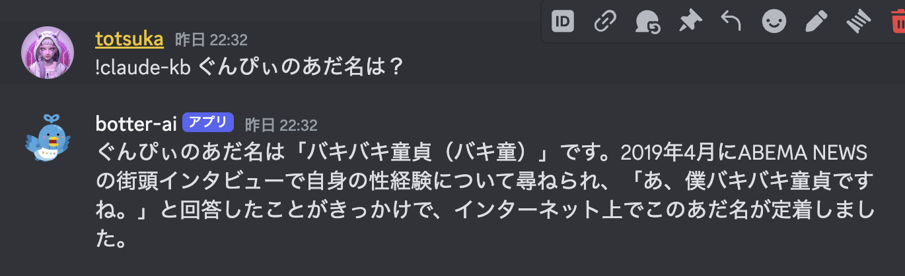

# Bedrock Knowledgebase

参考記事: https://aws.amazon.com/jp/blogs/news/leveraging-pinecone-on-aws-marketplace-as-a-knowledge-base-for-amazon-bedrock/

## 作成手順(参考記事の抜粋)

1. AWS Marketplace で Pinecone serverless をサブスクライブする
2. Pinecone の Index を作成する
3. Pinecone API Key を AWS Secrets Manager へ登録する
4. データソースを準備する
5. ナレッジベースを作成する
6. ナレッジベースをデータストアと同期する
7. ナレッジベースに API でアクセスする

## 参考

